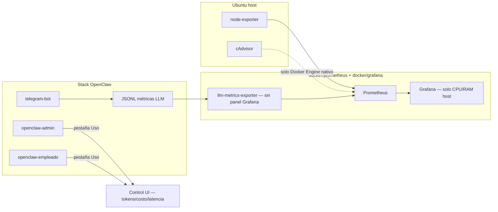

# Monitoreo y métricas de rendimiento (OpenClaw)

Historia de usuario: registrar consumo **CPU/RAM** en Ubuntu (inactividad y carga activa) y **latencia/tokens** de llamadas a **GPT-5.4** (cloud).

## Estrategia definitiva (CA5 — cierre de sprint)

Dos herramientas, cada una con un único dueño de la métrica (sin duplicar la misma serie en dos paneles):

| Métrica | Dónde se consulta | Por qué |
|---------|--------------------|---------|
| **CPU / RAM del host Ubuntu** | Grafana (`http://127.0.0.1:3000`), dashboard **OpenClaw — Monitoreo completo** | Serie temporal + inactividad vs carga; ya provisionado, ya validado (`node_load1` responde en Prometheus). |
| **Tokens, costo y latencia por sesión/día de los agentes GPT-5.4** | **Control UI de OpenClaw** (`:18790` empleado / `:18791` admin), pestaña **«Uso»** | Es una función **nativa** del gateway OpenClaw (no un desarrollo del monorepo): trae desglose por sesión, por día, por hora, costo y duración. Confirmado inspeccionando el bundle servido (`usageResult`, `usageCostSummary`, `usageTimeSeries`, `usageDailyChartMode`, etc.). Duplicar esto en Grafana solo agregaría una segunda fuente de verdad para el mismo dato. |

**Grafana queda exclusivamente para recursos de host.** No se agregan paneles de tokens/latencia LLM al dashboard de Grafana: se consultan en el Control UI, apartado «Uso», tal como ya documentaba `docker/grafana/README.md` (antes sin reflejar en este archivo — ahora alineado).

### Piezas que se mantienen como fuente cruda / opcional (no tienen panel propio)

- **JSONL de pruebas LLM** (`.llm-test-runs.jsonl` vía `/prueba_llm` o `docker/*/llm-test-logger/run.sh`; `integrations/telegram-bot/data/llm-metrics.jsonl` por cada turno de Telegram): siguen alimentando el panel de solo lectura **llm-test-panel** (puertos `18794` admin / `18795` empleado) para revisar el histórico crudo de una prueba puntual.
- **`llm-metrics-exporter`** (`:9092/metrics`) sigue corriendo y Prometheus lo sigue scrapeando (`job: llm-metrics`, ver `docker/prometheus/prometheus.yml`): expone `openclaw_llm_request_latency_seconds`, `openclaw_llm_tokens_total`, `openclaw_llm_requests_total` para quien quiera consultarlos por API/PromQL directamente. **No se apaga** (bajo costo, útil para scripts o una futura integración), pero **no se visualiza en Grafana** para evitar dos paneles de la misma métrica con distinta cobertura.

## Arquitectura



## CPU y RAM (Prometheus + Grafana)

Stacks **independientes**:

| Stack | Comando | URL |
|-------|---------|-----|
| Prometheus | `docker/prometheus/install.sh` | http://127.0.0.1:9090 |
| Grafana | `docker/grafana/install.sh` | http://127.0.0.1:3000 |

Orquestador opcional: `docker/monitoring/install.sh` (levanta ambos).

**Dashboard:** *OpenClaw — Monitoreo completo* (provisionado en `docker/grafana/dashboards/`). Cubre únicamente **CPU/RAM del host Ubuntu** (`node-exporter`); ver limitación de cAdvisor abajo.

### Escenario inactividad

1. Levanta admin + empleado + monitoring.
2. No envíes mensajes durante 15 min.
3. Anota CPU/RAM baseline en Grafana.

### Escenario carga activa

1. Ejecuta pruebas LLM (`docs/pruebas-latencia-ejemplos.md`).
2. Usa Telegram `/chat` o `/prueba_llm`.
3. Compara picos de CPU host en Grafana y latencia p95 en el Control UI, apartado «Uso».

### Limitación conocida — CPU/RAM por contenedor bajo Docker Desktop

`docker/prometheus/docker-compose.yml` levanta `cadvisor` con la configuración estándar de Linux (`/var/run`, `/sys`, `/var/lib/docker` montados `:ro`, `privileged: true`), que en un **Docker Engine nativo** (p. ej. Ubuntu LTS bare-metal) resuelve el nombre de cada contenedor y permite un panel por contenedor (`openclaw-admin`, `openclaw-empleado`, `telegram-openclaw-bot`).

Verificado en esta instancia (**Docker Desktop**): cAdvisor solo expone cgroups agregados (`id="/"`, `/docker`, `/kubepods`, `/podruntime`, etc., con `name` vacío) — la VM interna de Docker Desktop no expone el mismo árbol de cgroups por contenedor que Docker Engine nativo. Confirmado con:

```bash
curl -s 'http://127.0.0.1:9090/api/v1/query' --data-urlencode 'query=container_last_seen'
# metric.name viene vacío; metric.id son cgroups raíz, no contenedores individuales
```

**Mientras se use Docker Desktop:** para CPU/RAM por contenedor usa `docker stats` directamente en vez del dashboard:

```bash
docker stats openclaw-admin openclaw-empleado telegram-openclaw-bot --no-stream
```

**Si se migra a Ubuntu Docker Engine nativo** (ver `docs/migracion-nativo-a-docker.md`, `docs/ubuntu-lts-test.md`), cAdvisor debería resolver los nombres sin cambios de configuración; en ese caso vale la pena añadir paneles por contenedor al dashboard de Grafana.

## Latencia y tokens LLM

**Se consultan en el Control UI de OpenClaw, pestaña «Uso»** (ver tabla de estrategia arriba). Referencia de las métricas que además quedan expuestas en Prometheus (sin panel Grafana, solo para consulta directa):

| Métrica Prometheus | Descripción |
|--------------------|-------------|
| `openclaw_llm_request_latency_seconds` | Histograma latencia E2E |
| `openclaw_llm_tokens_total` | Tokens prompt/completion |
| `openclaw_llm_requests_total` | Contador por workspace/estado |

### Fuentes

1. **CLI:** `docker/*/llm-test-logger/run.sh` → `.llm-test-runs.jsonl` (visible también en `llm-test-panel`, `:18794`/`:18795`)
2. **Telegram:** cada llamada al gateway → `integrations/telegram-bot/data/llm-metrics.jsonl`
3. **Exportador:** escanea JSONL cada 15 s y expone `:9092/metrics` (consumido por Prometheus, no por Grafana)

Tokens se extraen del campo `usage` de la respuesta OpenAI-compatible cuando el gateway lo incluye.

### Langfuse / LiteLLM

Este sprint implementa **Prometheus + JSONL** nativo del repo (sin dependencias SaaS) como fuente cruda opcional, y el **Control UI «Uso»** como panel principal de tokens/costo/latencia. Para trazas por prompt en Langfuse:

- Desplegar Langfuse self-hosted y configurar callback OpenAI en OpenClaw cuando la versión lo soporte, **o**
- Interponer **LiteLLM** como proxy con `OPENAI_API_BASE` apuntando al proxy y métricas Prometheus nativas de LiteLLM.

Ver `docker/monitoring/README.md`.

## Referencias

- `docker/monitoring/README.md`
- `docker/grafana/README.md`
- `docker/prometheus/README.md`
- `docs/pruebas-latencia-ejemplos.md`
- `docs/pruebas-comunicaciones-admin-comms.md`
