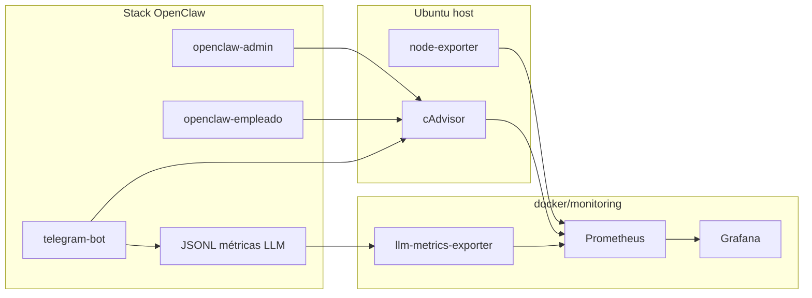

# Monitoreo y métricas de rendimiento (OpenClaw)

Historia de usuario: registrar consumo **CPU/RAM** en Ubuntu (inactividad y carga activa) y **latencia/tokens** de llamadas a **GPT-5.4** (cloud).

## Arquitectura

## CPU y RAM (Prometheus + Grafana)

Stacks **independientes**:

| Stack | Comando | URL |
|-------|---------|-----|
| Prometheus | `docker/prometheus/install.sh` | http://127.0.0.1:9090 |
| Grafana | `docker/grafana/install.sh` | http://127.0.0.1:3000 |

Orquestador opcional: `docker/monitoring/install.sh` (levanta ambos).

**Dashboard:** *OpenClaw — Monitoreo completo* (provisionado en `docker/grafana/dashboards/`).

### Escenario inactividad

1. Levanta admin + empleado + monitoring.
2. No envíes mensajes durante 15 min.
3. Anota CPU/RAM baseline en Grafana.

### Escenario carga activa

1. Ejecuta pruebas LLM (`docs/pruebas-latencia-ejemplos.md`).
2. Usa Telegram `/chat` o `/prueba_llm`.
3. Compara picos de CPU contenedor y latencia p95.

## Latencia y tokens LLM

| Métrica Prometheus | Descripción |
|--------------------|-------------|
| `openclaw_llm_request_latency_seconds` | Histograma latencia E2E |
| `openclaw_llm_tokens_total` | Tokens prompt/completion |
| `openclaw_llm_requests_total` | Contador por workspace/estado |

### Fuentes

1. **CLI:** `docker/*/llm-test-logger/run.sh` → `.llm-test-runs.jsonl`
2. **Telegram:** cada llamada al gateway → `integrations/telegram-bot/data/llm-metrics.jsonl`
3. **Exportador:** escanea JSONL cada 15 s y expone `:9092/metrics`

Tokens se extraen del campo `usage` de la respuesta OpenAI-compatible cuando el gateway lo incluye.

### Langfuse / LiteLLM

Este sprint implementa **Prometheus + JSONL** nativo del repo (sin dependencias SaaS). Para trazas por prompt en Langfuse:

- Desplegar Langfuse self-hosted y configurar callback OpenAI en OpenClaw cuando la versión lo soporte, **o**
- Interponer **LiteLLM** como proxy con `OPENAI_API_BASE` apuntando al proxy y métricas Prometheus nativas de LiteLLM.

Ver `docker/monitoring/README.md`.

## Referencias

- `docker/monitoring/README.md`
- `docs/pruebas-latencia-ejemplos.md`
- `docs/pruebas-comunicaciones-admin-comms.md`
